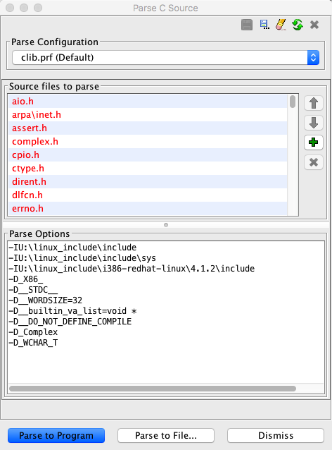
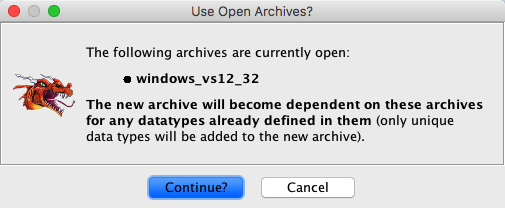
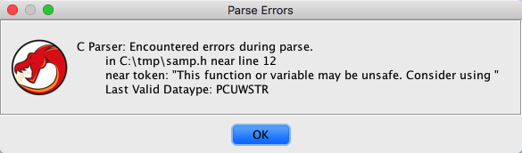

# C-Parser

The C-Parser plugin can be used to extract data type information from C-Header
files.  Data type definitions such as structures, enums, typedefs, and function
signatures are all extracted.  The extracted data types can be added to a currently open
program, or saved to a data type archive for re-use in multiple programs.  An archive
file can also be imported into an open project as a shared data type archive.

Why would you want to do this?

- The more data type information you have the better the decompiler output
- It is much easier, even with the initial frustration when setting up the parsing, than
entering data type information by hand
- Define values can be used as equates
- If you have symbol names for functions (debug information, name table, etc...) you can
**[Apply Function DataTypes](../DataTypeManagerPlugin/data_type_manager_window.md#apply-function-data-types)** from the data archive manager to any program.

One benefit of using the C-Parser over other methods of data type extraction (ie. debug
information embedded in a program), is all defines that have an integer value defined are
added to the archive as an **Equate** value.  For example, **`#define`**s
are sometimes used to setup error return codes.  These can be very useful to have when
annotating a program undergoing reverse engineering.

The C-Parser has a C-Preprocessor(CPP) phase and a parsing phase.  During the CPP
phase, traditional CPP directives (`#define`, `#ifdef`, etc...) are used to
build up a single file that has all CPP `#define` macro directives expanded just as in
a normal compilation process.  The second phase actually parses the output of the CPP
process according to C syntax, extracting the actual data type definitions.

> **Note:** The CPP macro expanded file is placed in the
user's home directory and called CParserPlugin.out.  This file is VERY useful for
debugging parsing problems, include order, and necessary "-D" directives.  Every attempt
is made to include line number information for each included file as part of this larger
file.

The C-Parser has been successfully used on Visual Studio, GCC, and Objective-C header
files.  The include files for GCC, Windows, MacOS, and ANSI C were all parsed with the
C-Parser plugin.  Most vanilla C-Header files can be parsed using the C-Parser.
However, just as in C software development the correct include order and "-D" pre-defines
must be specified.  Getting this correct can be much like porting an application from
one platform to another (linux program to visual studio).  The first time you compile
the ported program you will get all sorts of data type undefined errors, because the new
platform has some data type defined in a different header file or include location than the
original platform.

### Setting up to Parse

The C-Parser dialog has three sections:

- The Parse Configuration
The parse configuration selects an existing parser configuration.  The pre-defined
parse configurations can be used to re-parse a set of C-Header files, or as an example for
a new parsing configuration.  Sample configuration files that were used in parsing the
data type archives that are included with Ghidra distributions are available in the Parse
Configuration list.  These pre-parsed archives are applied automatically when programs
are imported.  If you are going to parse a new set of C-Header files, try using one of
the included .prf parse configuration files and replace the source files to parse with the
names of C-Header file to be parsed.
New configuration files can be created using the  button, and are added to the list.
- List of Source Files
The source file parse section is an ordered list of files that are parsed one after
another.  Data type definitions and C-Preprocessor `#define` definitions from
each file are available to each subsequent file in the list.
> **Warning:** Order of files in the list is
very important, just as the order of #include directives at the top of C-Source files are
important.
Files included using `#include` directives within C-Header files being parsed are
included as if the files were part of the compilation process.  If a file is
`#include`d by a file already part of the list of source files, it is not
necessary to add it to the list.  However the correct path to the included file must
be in the parse options section using the "-I" option.
 The add button is used to add files to
the list of source files to parse.  If you add a directory, all files in the
directory are parsed in the order they appear in the directory.
 The up/down arrows allows the re-order
the order the files in the source file list are parsed.  Each file is parsed before
files below it on the list.
  Removes all selected files from
the source file list.
- Parse Options
Parse options are exactly the same options that would be passed to a compiler when
building source.  Only the "-I" include path and the "-D`<name>`=`<value>`"
directives are supported.  Each directive should be on its own line.  "-D"
options can have an un-defined value, which means the definition simply exists and are
usually tested with an `#ifdef` type directive in the CPP phase of parsing.

> **Warning:** The newly created data type archive
will become dependent on any data type archives currently open in the Data Type
Manager.  For example, the Cocoa data type archive is dependent on the mac_osx data type archive.

> **Note:** It is strongly suggested that the basic data
type archive for the particular platform be open in the data type manager.  When parsing
C-Header files, undefined types will be used from the archives.  If you are unsure of
your target platforms core data types, it is suggested that the " generic_C_lib "
archive, which defines ANSI-C functions and data types, be open.

### C++ Header files

There currently is no support for parsing the information from C++ header files.  It
is possible to import information from C++ header files by compiling a program with the
desired header files included and the Debug option turned on for the compiler.  After
successful compilation and linking, import the program into Ghidra.  If the debug format
is supported fully, all function signatures and data types information that is used in the
program should be preserved.  Extracting data type information and function signatures
in this way does not recover as much information as parsing full C-Header files, however, it
can more accurately layout structure definitions.

## Tips:

Getting a new set of header files to parse can be frustrating.  Make use of the
CParserPlugin.out file produced in your home directory.

Use the Line numbers to determine where in the file the parse error occurred.

The last valid data parsed
displayed in the parse error dialog can be useful as well.  Search for it in the
CParserPlugin.out file and then look at the next defined data type for a parse error.

You can use the "-D`<name>`=`<value>`" directive to "define" away or redefine
nasty compiler specific directives like "__builtin_va_list" to "void"

"-D__builtin_va_list=void".

When adding a file to the source files to parse list, you can specify a directory.
Every file in the directory will be added to the list of source files.  This is very
useful if the original programmers did a good job protecting against double inclusion of
header files.  This is the norm in most modern day source code, but was definitely not
always the case.
