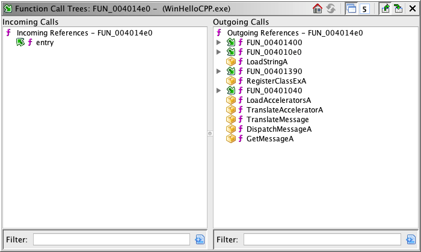

# Call Tree Plugin

The Call Tree Plugin shows all **callers** and all **callees** for
the **current function** (also known as the **main function**), which is the function
that contains the cursor location in the [Listing](../CodeBrowserPlugin/CodeBrowser.md). Functions which reference
or are referenced by the main function are also shown. You can expand the nodes in each of the
trees to show more information about these other functions. This plugin can be used to
gain a quick context of a given function by seeing incoming and outgoing function calls and
references.

You can launch this component by clicking the

> **Note:** Unlike most widgets in Ghidra, the Call
Trees display functions differently depending upon how you launch it. When launched from the toolbar icon, the provider that is shown will track the
current location in the Listing (the Navigate on Incoming Location Changes
button is on). When launched from the context popup menu, the provider that is shown will not track
the current location in the Listing.  This allows you to open multiple windows for
different functions, functioning much like snapshots , allowing you to keep a watchful eye on particular functions, regardless
of where you navigate within the tool.

The **Incoming** tree shows all functions calling
and/or referencing the main function. Each node in the tree has the incoming function
icon () combined with
() for calls and
() for other reference types. Expanding a
node in this tree shows all functions that call or reference the function corresponding
to the expanded node. Nodes may be expanded recursively to any depth desired.

The **Outgoing** tree shows all functions
called or referenced by the main function. Each node in the tree has the outgoing function
icon () combined with
() for calls and
() for other reference types.  Expanding a node in this
tree shows all functions that are called or referenced by the expanded node. Nodes may be
expanded recursively to any depth desired.

> **Tip:** The default operation of the plugin display is
to not change as the location changes in the Listing.  This allows you to trigger
navigation from inside of the trees without changing the function displayed by the trees.
In order to see a new call trees window for the location in the Listing, you can do
so  by clicking the icon in the Tool's toolbar, or by
right-clicking in the Listing and selecting References Show Call Trees

Alternatively, you may execute the 
[Navigate on Incoming Location Changes button](#actions)
on the call trees provider in order
to have that provider change as the location in the Listing changes.

#### Alternate Outgoing Icons

|  | Nodes with the stop icon        				indicate a call destination for which no other called functions can be       				determined. |
| --- | --- |
|  | This icon indicates an external function call, which has no outgoing       				calls. |
|  | This icon indicates that the given function has already been called        				somewhere in the path of calls.  For example, a function that calls itself       				would appear as an outgoing call of that function.  In this case, this icon       				would be applied to that node. |

## Filtering

You may enter text into either of the tree's filters.  This will search for
any function name matching the given text, based up on the filter settings.

> **Note:** The filter will only search down to the current depth setting .

## Actions

The following actions are buttons in the Call Tree Plugin header.

Home

The  home button will navigate to the function label of the main function
for which the call trees are being displayed.

The  refresh button will reload the trees.   This is needed due to the fact that
as changes are made to the program, the trees will not add and remove nodes in response.
Thus, you can edit as much as you like without affecting the structure of the trees.
The action's color will change to yellow if the provider detects that changes have
taken place that **may** affect the structure of the tree.

Unify Functions

The
 action, when toggled on, will filter out duplicate function calls.  For
incoming function calls, only one entry will exist in the child nodes for a given
function, even if that function calls the parent node multiple times.  For outgoing
function calls, only one entry will exist in the child nodes for a given function, even
if the parent node calls a given function repeatedly.
This setting is useful to see the set of all functions called in order to see the basic
function call graph.   When toggled off this action will show all function calls,
including duplicate calls, in address order. This setting is more useful to see the
overall flow of the main function and to navigate each individual call site.

Filter References

The
 action, when toggled on, will filter out function calls that are from
non-call reference types.  This setting is useful to see the set of all functions called
specifically with a reference type that is considered a call reference.
Toggling this setting off may be useful to see all ways functions are referenced, even
when they are not considered function calls by Ghidra.

Recurse Depth

The 
depth setting action allows you to see and change the depth of recursive operations.
For example,
the filter operation will expand nodes as deep as it can, limited only by the depth
setting.  Another example is the [expand action](#context-menu-actions), which will expand nodes recursively
until the current depth setting is reached.  The depth of a given node is defined as the
number of parents of a given node.

Navigate Actions

The  button, when toggled on,
indicates that location changes in the Code Browser will trigger the Call Tree Provider
to focus the display on the new location.

The  button, when toggled on, will cause
selections in the tree to navigate to the **source** of the selected
function within the main function. To navigate to the destination of a given
function, you can use the [Go To
Destination action](#context-menu-actions). No navigation will happen when toggled off.

Filter Thunks

The action, when toggled on,
will filter thunk functions out of the tree.

Show Namespace

The action, when toggled on,
will show the function namespace in the each node.

## Context Menu Actions

The following actions are available from the context menu by right-clicking.

The

**Collapse All Nodes** action will close all nodes in the tree, except for the
direct children of the root node.   This allows you to collapse all nodes after expanding them,
which can be useful when trying to get an overall view for the different flows out of
a function.  For example, you can expand all nodes to get an overview, pick a single
path out of the node, collapse all nodes and then expand only the child node of
interest.

The

**Expand Nodes to Depth Limit** action will expand the selected node(s) as far as possible until
there are no more child nodes to expand of the
[depth limit](#actions) is reached.

Select Source

The **Select Source** action will make a [program
selection](../Selection/Selecting.md) for the node(s) selected in the tree where the context menu was activated.
When activated from the [incoming call tree](#call-tree-plugin), the calling
or referencing function's entry point will be selected. When activated from the [outgoing call tree](#call-tree-plugin) the address of the instruction containing the
call or reference will be selected.

Select Destination

The **Select Destination** will make a [program
selection](../Selection/Selecting.md) for the node(s) selected in the outgoing tree. The selection will be the
called or referenced function's entry point.

Navigate to Source

The **Go To Source** action will navigate the Listing to the address of the selected node in the
tree where the context menu was activated. When activated from the [incoming call tree](#call-tree-plugin), the Listing will be navigated to the calling
or referencing function's entry point. When activated from the
[outgoing call tree](#call-tree-plugin) the Listing will be navigated to
the address of the instruction containg the call or reference.

Navigate to Destination

The **Go To Destination** will navigate the Listing to the entry point of the appropriate function.

The
**Show Call Tree for (Function Name)** will load the function for the selected node
**into the current Call Tree window**.

Provided by: *Call Tree Plugin*

**Related Topics:**

- [Code Browser](../CodeBrowserPlugin/CodeBrowser.md)
- [Program Selection](../Selection/Selecting.md)
- [References](../ReferencesPlugin/References.md)
