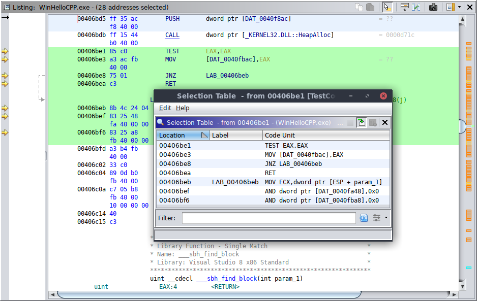

# Selection Tables

The **Create Table From Selection** action will create a table of addresses based upon
the current selection in the [Listing](CodeBrowser.md#listing-view). Each entry in
the table represents a code unit that may span a range of address. If a given selection in the
listing does not contain any code units, then no table will be created.

Selection Table

To create a table from the current selection within the [Listing](CodeBrowser.md#listing-view), press **Select  → Create Table From Selection** from the tool's menu bar.

The **Create Table From Ranges** action will create a table based on the
current selection.  Each row of the table corresponds to an address range in the selection.

### Range Table Actions

There are two special actions available on an address range table:

- **Select Minimum Addresses**
This action creates a program selection containing the minimum address of each selected
address range.
- **Select Maximum Addresses**
This action creates a program selection containing the maximum address of each selected
address range.

*Provided by: *Code Browser* plugin*

**Related Topics:**

- [Listing View](CodeBrowser.md#listing-view)
