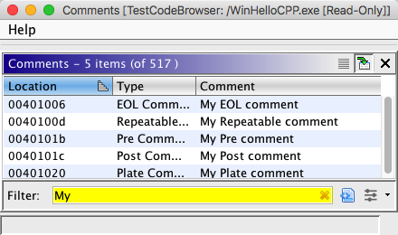

# Comment Window

The **Comment Window** provides a list of comments defined in the currently open program. To display
the **Comment Window**, select the **Window** → **Comments** from the tool menu.

This window has three columns. The **Location** column shows the comment's address.
The **Type** column shows the comment type.
The **Comment** column shows the contents of the comment. Click on
the top of a column to sort the list by that column. By default, the comments are sorted by address
in ascending order. You can add or remove other columns just like you can in any other Ghidra table.
See  [Ghidra Table Headers](../Tables/GhidraTableHeaders.md) for more
inforamtion about Ghidra tables.

Click on a row to navigate to the corresponding comment in the Listing.

### Make Selection

The Comment Window's tool bar has a button that will [select](../Selection/Selecting.md) all of the code units in the Code Browser
display corresponding to the selected rows  in the table. Since the table allows for
multiple selections, any number of comment items may be selected. To make the selection, either
click on , or right mouse click in the table and choose
**Make Selection**.

Provided By: *CommentWindowPlugin*

**Related Topics:**

- [Selection](../Selection/Selecting.md)
- [Comments](../CommentsPlugin/Comments.md)
