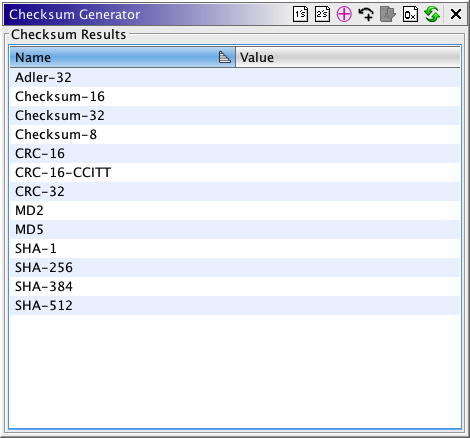
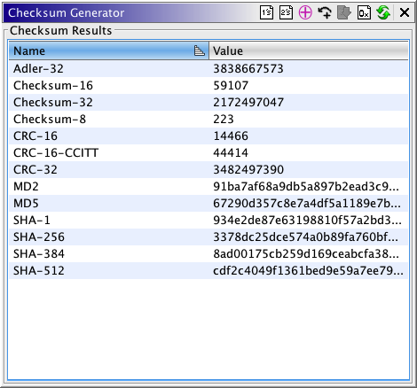

# Checksum Generator

The Generate Checksum action generates checksums on the entire program or the current
selection

These are the checksums that are calculated:

Group checksums together using color and indentation

### Checksum-8

Uses a 8-bit count.  This checksum adds all of the bytes in a selection or entire
file, then calculates the checksum result, mod 28.

### **Checksum-16**

Uses a 16-bit count.  This checksum adds all of the words in a selection or
entire file, then calculates the checksum result, mod 216.

### **Checksum-32**

Uses a 32-bit count.  This checksum adds all of the dwords in a selection or
entire file, then calculates the checksum result, mod 232.

> **Note:** All of the preceding checksums may be modified using the XOR and Carry toggle buttons. XOR causes the fields to be XORed rather than added. Carry causes the overflow to be added back to the sum.

Group checksums together using color and indentation

### Adler-32

Uses a 32-bit count.  This checksum calculates a running checksum over the bytes
in a selection or entire file.

### **CRC-16**

Uses a 16-bit count.  This checksum calculates a running checksum over the bytes
in a selection or entire file.  Uses an inverted bit polynomial of 0xA001 from
0x8005, with an initial value of 0x0000.

### **CRC-16/CCITT**

Uses a 16-bit count.  This checksum calculates a running checksum over the bytes
in a selection or entire file.  Uses a polynomial of 0x1021, with an initial value
of 0xFFFF.  This checksum also uses the low and high values of the running checksum
to get a final result.

### **CRC-32**

Uses a 32-bit running checksum over the bytes in a selection or entire file.  The
polynomial used is 0x4C11DB7, and the initial value is 0xFFFFFFFF.

> **Note:** All of the preceding checksums may be modified using the 1's Complement and 2's Complement toggle buttons. 1's Complement causes the fields to be complemented with a ones complement. 2's Complement causes the fields to be complemented with a twos complement.

Group checksums together using color and indentation

### **MD2**

Uses a 128-bit (16-byte) count. The MD2 hash is always represented in hexadecimal
format.

### **MD5**

Uses a 128-bit (16-byte) count. The MD5 hash is always represented in hexadecimal
format.

### **SHA-1**

Uses a 160-bit (20-byte) count. The SHA-1 hash is always represented in
hexadecimal format.

### **SHA-256**

Uses a 256-bit (32-byte) count. The SHA-256 hash is always represented in
hexadecimal format.

### **SHA-384**

Uses a 384-bit (48-byte) count. The SHA-384 hash is always represented in
hexadecimal format.

### **SHA-512**

Uses a 512-bit (64-byte) count. The SHA-512 hash is always represented in
hexadecimal format.

*It is now possible to write a custom checksum algorithm and add it to the table using a script. Contact the Ghidra Team for more detail.*

---

## Using the Checksum Generator

To display the *Generate Checksum* dialog, select **Tools** → **Generate Checksum...** or select **Window** → **Checksum Generator**.  The results of the thirteen types
of checksums can be viewed in decimal or hex format. There is also an option to have the
applicable results displayed in 1's or 2's complement.

### Checksum Options:

#### As Hex 

Toggle this option to display all results as hexadecimal format. Otherwise, applicable
checksums will be displayed as decimal format.

#### On Selection 

Toggle this option to limit the checksum calculations to the bytes contained in the
current selection. A selection must exist for this option to be enabled. Otherwise, the
checksum calculations are computed over all bytes in the entire program.

#### Carry 

Toggle this option to perform a carry operation on the applicable checksums.

#### XOR 

Toggle this option to perform an XOR on the applicable checksums.

#### 1's Complement 

Toggle this option to perform a 1's complement on the applicable checksums.

#### 2's Complement 

Toggle this option to perform a 2's complement on the applicable checksums.

*Once the results are posted in the table, choosing another checksum option will automatically update the results, without your having to regenerate the results.*

### Generating Checksums:

To compute the checksums, click on the *Generate* button () or make a selection in the listing. When the *Generating Checksums* task is completed, the checksum results are displayed in the *Checksum Results* panel. If the checksum generation is cancelled before completion, the fields will
all be blank.

**Provided by:** *ComputeChecksumsPlugin*
