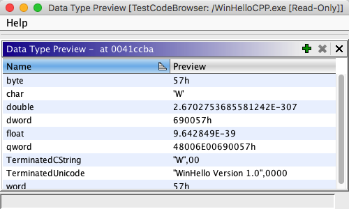

# Data Type Preview

The Data Type Preview provides a preview of bytes at an address based on data
types that you choose to view. As you move the cursor to different addresses, the Preview
column will update with the appropriate representation for each data type. If the value in the
*Preview* column represents a valid address, you can double-click on the *Preview*
column and navigate to that address in the [Listing](../CodeBrowserPlugin/CodeBrowser.md).

## Adding Data Types

Click the  button and select a datatype from the [Data Type Chooser](../DataTypeEditors/DataTypeSelectionDialog.md).

OR

Data types can be dragged from the [Data Type Manager](../DataTypeManagerPlugin/data_type_manager_description.md)
and dropped into the Data Type Preview table. If you add a structure or union, then a row
will be added for member of the structure or union.

*The data type preview does not support *dynamic* data types. However, keep in mind that not all variable-length data types are dynamic. Specifically, you **can** use data types that implement* `Dynamic` *as long as they do not also extend from*
`DynamicDataType`.

## Removing Data Types

Select the row(s) to delete and click on the  to remove data types from the table.

*If you remove a structure member, then entire structure will be removed from the preview table*

*Provided by: DataTypePreviewPlugin*

**Related Topics:**

- [Listing](../CodeBrowserPlugin/CodeBrowser.md)
- [Data Type
Manager](../DataTypeManagerPlugin/data_type_manager_description.md)
- [Data](../DataPlugin/Data.md)
