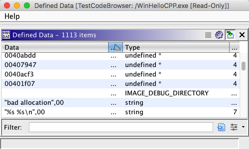
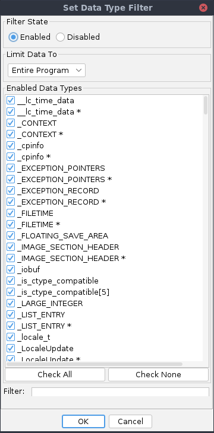

# Data Window

The Data Window provides a list of data defined in the currently open program. To display
the *Data Window*, select the **Window** → **Defined Data** from the tool menu.

This window has four columns. The **Data** column shows the string representation of the
data. The **Address** column shows the function's address. The **Type** column shows the
name of the data type. The **Size** column shows the size (in bytes) of the data. Click on
the top of a column to sort the list by that column. By default, the data is sorted by address
ascending.

Click on a row to navigate to the corresponding data.

### Make Selection

The data window's tool bar has a button that will [select](../Selection/Selecting.md) all of the code units in the Code Browser
display corresponding to the selected rows  in the table. Since the table allows for
multiple selections, any number of data items may be selected. To make the selection, either
click on , or right mouse click in the table and choose
**Make Selection**.

### Filtering Types

Click on the filter icon  in the tool bar of the *Data Window* to launch the data filter dialog. This dialog allows you to filter the type of
data displayed in the data window, including the ability to limit data to the current
selection or [current view](../CodeBrowserPlugin/CodeBrowser.md#the-view).
An example of the dialog appears below.

Use the radio buttons in the *Filter Enable* panel at the top of the dialog to enable
and disable the filter. By default, the filter will be enabled. When the filter is enabled,
the icon at the top of the data window is depressed to indicate that the displayed data has
been filtered. When the filter is disabled, all defined data types will show in the *Data Window*.

Use the drop down menu to limit data displayed by the data window. You may select
**Entire Program** (display all data), or **Current View** (display only data in the
current view in the code browser). If there is a selection in the Code Browser, then an
additional choice for **Current Selection** (display only data in current selection) is
present in menu. By default, all data will be displayed.

Use the checkboxes to choose which data types to include. Deselect a checkbox to exclude
the type; select a checkbox to include the type. By default, all types are selected.
When new data types are added to the program, this list is updated.

You'll notice that the checkbox list is ordered Alphabetically in natural ASCENDING order,
in a case-insensitive manner. Use the "Filter:" text field to limit the shown Data Types
checkbox list in the *Filter Enabled Data Types List Above* panel. The more accurate
your filter, the more accurate and succint your shown Data Types result set will be. The
letters typed in the filter will correspond to the matched Data Types in the list via the
**bolding** of each matching character. This will assist you in rapidly accessing the Data
Type of your choice. Moreover, if you know only part of the Data Type word, just begin typing
the part you know, and that Data Type (if it exists in the list) will show up in the matched
list based on the letter(s) that you know. The matching filter will find the first sequence
of the substring you type into the filter regardless of whether or not that substring is at
the beginning of the Data Type or not. Note: During this phase of filtered list typing, the
"Select All" and "Select None" buttons will be temporarily disabled while the list filter is
active (field will show up in yellow); simply remove each letter from this field to restore
the non-filtered state. Also, all filtering, is case-insensitive.

Provided By: *DataWindowPlugin*

**Related Topics:**

- [Selection](../Selection/Selecting.md)
- [Data Types](../DataPlugin/Data.md)
