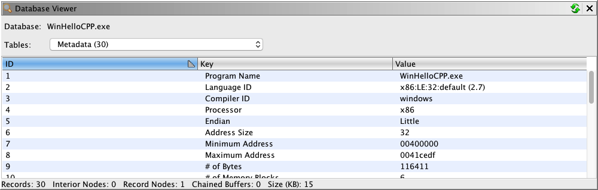

# Database Viewer

The Database Viewer displays the raw database tables used in the Ghidra program database.

This plugin is currently a developer plugin that must be added to the tool before
it is available.  See the [Configure Tool](../Tool/Configure_Tool.md) help page.

The viewer is available from the **Window → Database Viewer** menu.

The table's combobox is used to select which database table to view.  The table will then
show each row in that table and for each row, it will display the values for all the database
columns.

Provided by: *DBViewerPlugin*
