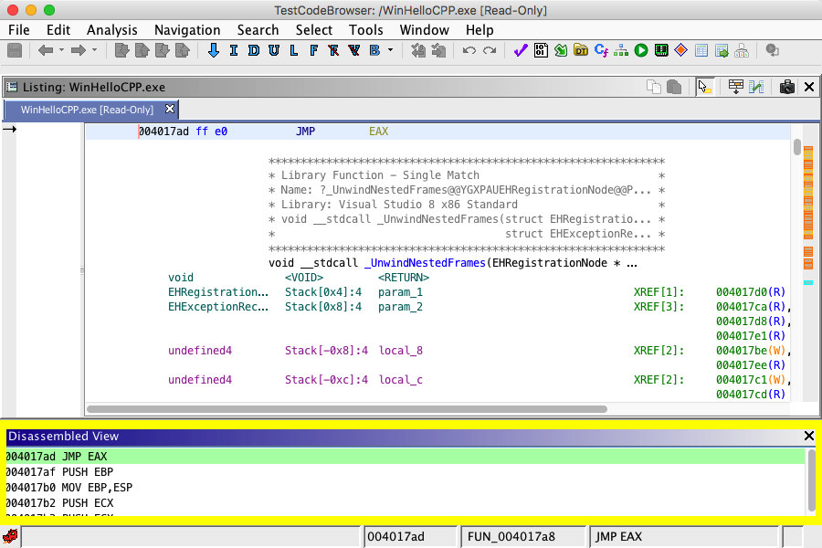

# Disassembled View Plugin

The Disassembled View Plugin is for viewing the **virtual** disassembly for the given
address and a small number of addresses beyond the selected address.

*The highlighted window is the Disassembled View Plugin*

## Main Display

The display of the plugin shows a simple list of addresses. The highlighted address is the
currently selected address in the [Code Browser](../CodeBrowserPlugin/CodeBrowser.md)'s Listing View.

The remaining addresses are those that follow the currently selected address. The plugin
will look ahead for a small number of addresses in order to provide some context for the
current address. The plugin will only show valid address previews in the display. Thus, if
the display is empty, then the current address is not in a valid range of memory.

## Display Settings

The following display characteristics of the plugin are based upon the Code Browser's
settings:

- **Font** - "Listing Display" -&gt; "Address Font"
This controls the font used to display the characters in the plugin.
- **Background Color** - "Listing Display" -&gt; "Background Color"
This is the background color of the plugin, which is the background color of each list
entry that is not selected or not the current address at the selected program location in
the code browser listing.
- **Text Color** - "Listing Display" -&gt; "Address Color"
This is the color of the text of the plugin.
- **Selected Address Color** - "Listing Fields" -&gt; "Selection Colors" -&gt; "Selection
Color"
This is the background color of the item in the list that is the address of the selected
program location in the code browser listing.
- **Address Display Style** - "Listing Fields" -&gt; "Operands Field" -&gt; "Show Block
Names"
This option affects how the text form of the address is displayed in the plugin window.

Provided By: *DisassembledViewPlugin*

**Related Topics:**

- [Code
Browser](../CodeBrowserPlugin/CodeBrowser.md)
- [Code
Browser Options](../CodeBrowserPlugin/CodeBrowserOptions.md)
