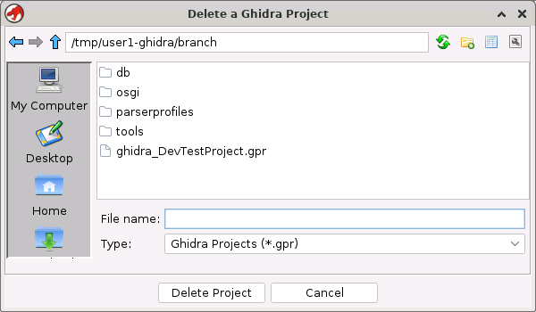
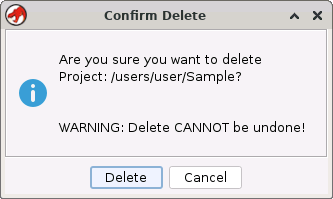

# Delete Project

Deleting a Ghidra project *\**permanently*\** removes the
project and all its associated programs and information from storage. This operation cannot be
undone. A deleted project cannot be recovered nor can any of its programs. Therefore, much care
should be exercised when using this function. You may want to [archive the project](Archive_Project.md) first, close it, and then delete it.

> **Note:** You can delete a project if the project is not
your current project.

To delete a project,

1. Select **File → Delete Project** from the menu. The *Delete a Ghidra Project* dialog will appear.

1. Select the project, i.e. project_name.gpr, to delete or enter its name in the *File name* field. The project cannot be your active project.
2. Click the **Delete Project** button.
3. If the selected project is not your active project,  then the *Confirm Delete*
dialog as shown below is displayed; click the **Delete** button to permanently delete the
indicated project.

**Related Topics:**

- [New Project](Creating_a_Project.md)
- [Ghidra Projects](../Project/Ghidra_Projects.md)
