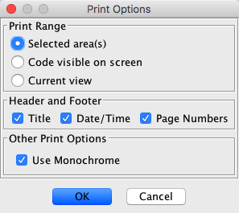

# Printing

Ghidra includes printing support that allows disassembled code to be printed
using the same formatting as the code browser.  Printing can be limited to
the current view, the current selection, or code currently on the screen in
the code browser.  Printed code will appear with the same fonts, colors, and
spacing as code on the screen.

To Print:

  1. You can optionally specify page settings (paper size, orientation,
margins, etc.).  To do this, select File →
Page Setup... from the code browser tool.
  2. To print, select File →
Print...
  3. Select the content to print as well as other printing options in
the dialog that appears.  Click "OK" when finished.
  4. Select printer-specific options in the printing dialog that appears.
Click "OK" to begin printing.

## **The Page Setup Dialog**

When page setup is selected from the File menu, the standard page setup
dialog is displayed.  The exact appearance of this dialog is platform dependent
and will vary based on the operating system used.  The above image is an
example of how this dialog appears on Windows XP.

Generally, the page setup dialog will allow you to specify the paper size,
orientation, and margin.  Margins will automatically be adjusted to fit the
specified paper and printer.

## **The Print Options Dialog**

When you select **Print** from the **File** menu, a dialog with basic options is
displayed.  This dialog allows you to choose what to print, including whether
to put headers and footers on each page.  You can choose to print the current
selection (if there is a current selection), the code currently visible in
the code browser, or all code in the current view.  You will be prompted
later to choose specific page ranges.

The print options dialog also includes an option to print the code in monochrome.
When selected, this option will cause all text to be printed as solid black.
For printers that do not print color or do not produce good grayscale, it
may be useful to enable this option.

## **The Print Dialog**

Finally, the print dialog is displayed.  This generally allows you to select
and configure the printer and choose copies and page ranges.  As with page
setup, this dialog varies on different platforms.  The above example was
taken with Windows XP.

## **Printing**

Once printing starts, a task dialog is displayed showing current progress.
You may notice that the progress meter seems to indicate that the same page
is printed multiple times even when only one copy is specified.  This is normal
behavior.  The print job can be cancelled at any time by pressing the cancel
button, although pages already sent to the printer cannot be stopped.
