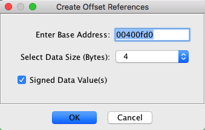
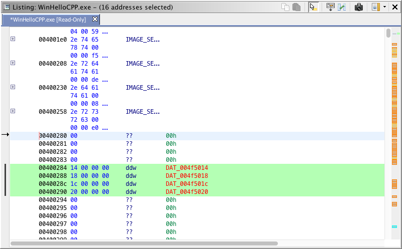

# Create Offset References Table

The "Create Offset References" option allows you to create offset tables based on a
selection of one or more data code units within the listing. A dialog as shown below is
displayed so that you can enter a base address, the offset size to be used for each data
unit(s) to be created within the selection, and whether each offset data value should be
interpreted as signed or unsigned. The *value* of the data at an address is added to the
*base address* to create a new *memory reference* address. The reference is placed on
the new data.

To create an offset table,

1. Make a [selection](../Selection/Selecting.md) in the Code Browser;
the selection should not contain instructions.
2. Right mouse click and choose the **References →
Create Offset Reference** option.
*If the selection contains
instructions, then a warning message is displayed in the tool status area.*
3. The "Enter Base Address" field in the dialog is filled in with the first address in the
selection. You can enter a different address
(or [Address Expression](../Misc/AddressExpressions.md))
as the base address.
4. The "Select Data Size" combo box has an entry for sizes 1, 2, 4, and 8. The size you select
determines the type of data that is created:
  - 1 ==&gt; Byte (db)
  - 2 ==&gt; Word (dw)
  - 4 ==&gt; Double word (ddw)
  - 8 ==&gt; Quad word (dq)
5. The "Signed Data Value(s)" checkbox indicates whether the *value* of the data at the
address should be interpreted as a signed or unsigned number. When the box contains a check
mark, the data will be added to the *base address* as a signed *value*.
6. Click the **OK** button.
Any defined data in the selection is cleared. For each resulting data type in the
selection, the *value* of the data type is added to the base address to create a
reference address. This reference address is placed on the data; the reference is set to
be the primary reference so that the operand field shows up as a "DAT," if no other
symbol exists for this reference address.

*If the value of the data type being used
as the offset does not result in a valid address for the reference, then a message is
displayed in the status area of the tool. The data type will have been created, but not the
reference.*

The image below shows the result of creating an offset reference table; the base address
for the references is 004f5000. Value references were created on the double word data
types.

&gt;

*Provided by: *Create* *Offset References* Plugin*

**Related Topics:**

- [Selection](../Selection/Selecting.md)
- [Code
Browser](../CodeBrowserPlugin/CodeBrowser.md)
