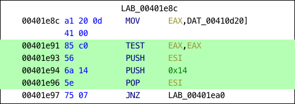
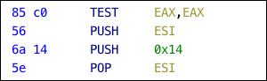
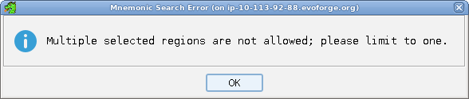

# Search for Matching Instructions

This action works only on a selection of code. It uses the selected instructions to build
a combined mask/value bit pattern that is then used to populate the search field in a
[Memory Search Window](Search_Memory.md). This enables searching through memory
for a particular ordering of
instructions. There are three options available:

- **Include Operands** - All bits that make up the instruction and all bits that make
up the operands will be included in the search pattern.
- **Exclude Operands** - All bits that make up the instruction are included in the
search pattern but the bits that make up the operands will be masked off to enable wild
carding for those bits.
- **Include Operands (except constants)** - All bits that make up the instruction are
included in the search pattern and all bits that make up the operands, except constant
operands, which will be masked off to enable wild carding for those bits.

Example:

A user first selects the following lines of code. Then, from the Search menu they choose
**Search for Matching Instructions** and one of the following options:

**Option 1:**

If the **Include Operands** action is chosen then the search will find all
instances of the following instructions and operands.

All of the bytes that make up the selected code will be searched for exactly, with no
wild carding. The bit pattern **10000101 11000000 01010110 01101010 00010100 01011110** which equates to the byte pattern **85 c0 56 6a 14 5e** is searched
for.

**Option 2:**

If the **Exclude Operands** option is chosen then the search will find all
instances of the following instructions only.

Only the parts of the byte pattern that make up the instructions will be searched for
with the remaining bits used as wildcards. The bit pattern **10000101 11...... 01010... 01101010 ........ 01011...** is searched for where the .'s indicate the wild carded
values.

**Option 3:**

If the **Include Operands (except constants)** option is chosen then the search
will find all instances of the instruction and all operands except the 0x14 which is a
constant.

The bit pattern **10000101 11000000 01010110 01101010 ........ 01011110** which
equates to the byte pattern **85 c0 56 6a xx 5e** is searched for where xx can be any
number N between 0x0 and 0xff.

> **Note:** The previous operations can only work on a single selected region. If multiple regions are selected, the following error dialog
will be shown and the operation will be cancelled.

Provided by: *Mnemonic Search Plugin*

**Related Topics:**

- [Search Memory](Search_Memory.md)
