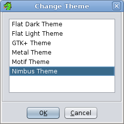
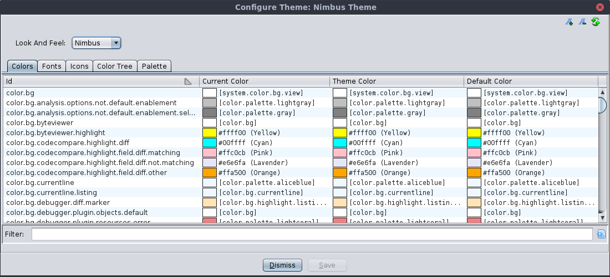
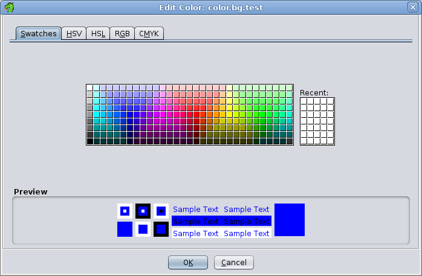
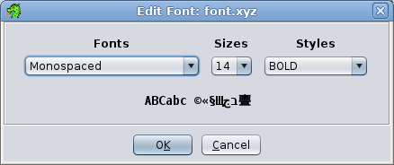
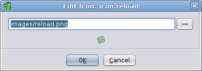

# Themes


## Description


The Theming feature allows users to customize the colors, fonts, and icons used throughout
the application. The active theme determines the Java Look and Feel, whether the theme should
use light or dark defaults, and any custom colors, fonts, and icons that override the default
values. Users can easily switch between any of the built-in themes or any saved themes found
in their home application directory


Users can also edit and create their own themes using the Theme Editor. Custom themes are
stored in the user's `<user settings>/themes` directory.
These theme files are simple text files that can
easily be modified using any text editor. Also, users can share themes by exporting them to a
file that can be given to other users who can them import them into their application.


**NOTE:** The `<user settings>` directory is platform/configuration
specific. Its value can be found in the Ghidra Front End GUI, under `Help ->
Runtime Information -> Application Layout -> Settings Directory`


## Theme Chooser Dialog


The Theme Chooser allows users to switch themes.





The Theme Chooser dialog displays a list of all the known themes, both built-in and custom.
Select the desired theme and press the "OK" button to have the application switch to that
theme. Pressing the "Cancel" button will exit the dialog without changing the theme. You
can also double click on a theme to switch to that theme and exit the dialog.


## Theme Editor Dialog


The Theme Editor Dialog is the primary means for creating and editing themes.





The Theme Editor Dialog consists of a Look And Feel drop-down and a tabbed set of tables that
display the values for every color property, font property, and icon property defined by either
the Java look and feel or the application. The properties fall into one of the following
groups


- Application Properties - these are application defined properties. They all start with
either "color.", "font.", or "icon.", depending on whether the property is a color, font,or
icon respectively.
- System Properties - these are well defined Look and Feel concepts such as various
standard background and foreground colors, border color, and fonts. These all start with
"system." and their values are mapped to specific values for each Java Look and Feel.
- Look and Feel Properties - these are the properties defined by the current Java
Look and Feel. Ghidra prepends these properties with prefixes that start with either
"laf.color.", "laf.font"., or "laf.icon." For example, if the Look and Feel defines a property
called "Button.background", it would appear in Ghidra as "laf.color.Button.background".
- Look and Feel Palette Properties - All the color and fonts used by the Look and Feel
properties are grouped into either system property values or auto-generated palette
properties, so that groups of properties can be changed together.


See the [Developer Documentation](ThemingDeveloperDocs.md#resource-id-strings) for more
details on the property ID format and naming conventions.


Each table entry shows the property ID string, the current value, the theme value,
and the default value. Most often, the three values are equal. If the theme value is different
from the default value, that means that the active theme has overridden the default value for
that property. If the current value is different from the theme value, that means the user has
changed that value, but not yet saved the changes back to the theme.


Individual values can be changed by double-clicking the value in the ID or Current Value
column. This will bring up an appropriate editor for changing the value. When editing a value,
the change
takes place immediately in the application so you can see the effect. When you leave the
specific property editor, you have the choice of keeping the change or canceling and having it
revert back to its previous value.


If any values have been changed, the **Save** button will become enabled, allowing you to save
any changes you have made. (Pressing the **Dismiss** button will also give the option to
save.) When saving, if the
current theme is a built-in theme, you will first have to supply a new theme name. If the
current theme is a not a built-in theme, you will have the option to overwrite the existing
theme or supplying a new name to save it as a new theme.


### Theme Editor actions


- <a name="increment-fonts"></a>[Increment] Increment All Fonts - Increases all fonts in the system by one.
- <a name="decrement-fonts"></a>[Decrement] Decrement All Fonts - Decreases all fonts in the system by one.
- <a name="reload-theme"></a> Reload Theme - Restores all color, font, and icon values back to the original theme values.


### Color Editor


When you double-click on a color value, the Edit Color dialog appears.





Any change you make in the editor is applied to the application immediately. If you press
the **OK** button, the change will stay. If you press the **Cancel** button, the color
will revert back to the original color.


### Font Editor


When you double-click on a font value, the Edit Font dialog appears.





Any change you make in the editor is applied to the application immediately. If you press
the **OK** button, the change will stay. If you press the **Cancel** button, the font
will revert back to the original font.


### Icon Editor


When you double-click on an Icon value, the Edit Icon dialog appears.





The Edit Icon dialog has a drop-down text field where you can find any existing icon on
the classpath. If you want to choose an Icon from the file system, press the **...** button
and a File Chooser will appear, allowing you to pick an icon file from anywhere on the filesystem.
Any change you make in the editor is applied to the application immediately. If you press the
**OK** button, the change will stay. If you press the **Cancel** button, the icon will
revert back to the original icon.


## Theme Actions


### Switching Themes


To change the current theme, invoke the
**Edit → Theme → Change..."**menu option
from the main project window. This will bring up the [Theme Chooser Dialog](#theme-chooser-dialog)which allows you to pick a new theme.


### Modifying Theme Values


All the colors, fonts, and icons that have been registered with the theme API can be
modified using the [Theme Editor Dialog](#theme-editor-dialog). The Theme Editor Dialog
can be invoked from the main application menu using the
**Edit → Theme → Configure"** menu. Choose the
tab for the appropriate type and double-click on the ID column or Current Value column of the
item you want to change. An editor for that type will appear.


### Creating New Themes


To create a new theme, invoke  **Edit → Theme → New..."**menu option. This will bring up a new
dialog where you can enter the new theme name and select another theme as a starting point.
When the **OK** button is pressed, the Theme Editor Dialog will appear, allowing you
to begin making changes to theme values.


### Reseting Theme Values


To reset an individual value back to its original theme value, invoke the [Theme Editor Dialog](#theme-editor-dialog). Choose the tab for the appropriate type and
right-click the one the row in the able you want to reset, then choose the
**Restore Value** menu item from the popup menu.


### Reseting All Theme Values


To reset all values back to the original values established by the current theme,
invoke the [Theme Editor Dialog](#theme-editor-dialog). To activate this
action, press the refresh button  in the top
right corner of the Theme Editor dialog.


### Toggle Showing System Values


Toggles whether the given table shows system ID values (e.g, those starting with `
laf.` or `system.`.  By default these values are hidden.


### Saving Themes


After making changes to one or more theme values, the [Theme
Editor Dialog's](#theme-editor-dialog) **Save** button will be enabled. Pressing the **Save** button will give
the user the option of creating a new theme or overwriting the current them (if the current
theme is not a built-in theme). Also, users will have the option of saving a theme if they
dismiss the Theme Dialog while there are changes to one or more theme values.


### Deleting Themes


Only custom non-built-in themes can be deleted. To delete a custom theme, invoke the
**Edit** → **Theme**  → **Delete...** menu from the main application
menu. This will bring up a dialog
with a list of themes that can be deleted. Select the theme to delete and press the **Ok**
button.


### Exporting Themes


To export a theme so that it can be shared with others, invoke the **Edit**  → **Theme**  → **Export..** menu from the main application
window. You will first be asked if
you want to export as a regular theme file or as a Zip file. The Zip file option is useful if
the current theme has icon values that are not included with standard application. In that case,
the Zip file will include those non-standard icon files.


### Importing Themes


To import a theme,
invoke the **Edit**  → **Theme**  → **Import...**
menu from the main application menu. A file chooser dialog will appear
allowing the user to choose a theme file
to import. The selected file can be either a standard theme file or a Zip file containing the
theme file and any non-standard icon files defined by that theme.


## Theme Property Names


Theme Property Names (also referred to as IDs or keys) that are defined by the application
use a common format to help make sorting and viewing properties more intuitive as to their use.
See the [Developer Documentation](ThemingDeveloperDocs.md#resource-id-strings) for more
details on the property ID format and naming conventions.


## Theme Files


Theme Files are used to store saved custom themes. They are simple text files and are
stored in the user's home application directory under
`<user settings>/themes`. The first three properties
are always the theme name, the Look and Feel name, and whether the theme uses standard
defaults or dark defaults. Finally, there is a list of overridden property "name = value"
lines. The format is:


`

name = [theme name]
Look and Feel = [Look and Feel name]
useDarkDefaults = [true or false]

[theme id 1]= [color, icon, or font value]
[theme id 2]= [color, icon, or font value]
[theme id 3]= [color, icon, or font value]
[theme id 4]= [color, icon, or font value]
...

`


Example:


```

        name = BigFontTheme
        Look and Feel = Nimbus
        useDarkDefaults = false

        color.bg = Black
        color.bg.foo = #012345
        font.button = dialog-PLAIN-14
        icon.refresh = images/reload3.png
        color.bg.bar = color.bg.foo
        [laf.color]Panel.background = silver
        [laf.color]TextArea.background = [laf.color]Panel.background

```


Each property line is expected to begin with either "color.", "font.", or "icon." Since
java defined properties don't start with these prefixes, they will have "[laf.color]",
"[laf.font]", or "[laf.icon]" prepended to their property name. These brackets are only used
to aid in parsing this file. When the properties are used in Ghidra, the bracketed prefixes are
removed.


Also, note that the values of these properties can reference other property names. If the
right side of the assignment is a property name and not a value, then it must also use the
bracketed prefix if the property name doesn't start with "color.", "font.", or "icon."


### Specifying Theme Property Values


Specifying property values varies depending on whether it is a color, font, or icon. Fonts
and icons also support specifying modifiers. For a complete description of how to specify
these values, see the [Developer Documentation](ThemingDeveloperDocs.md#theme-property-values).


*Provided by: *Theme Manager**


**Related Topics:**


- [Theming Overview](ThemingOverview.md)
- [Theming Developer's Guide](ThemingDeveloperDocs.md)
- [Theming Architecture](ThemingInternals.md)
