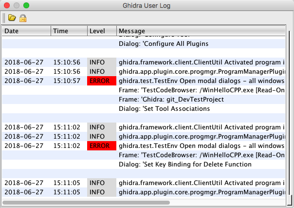

# Show the Ghidra log file

The **Show Log Bug** action brings up a dialog that displays a rolling log of all Ghidra
messages. The log includes messages from previous runs of Ghidra in addition to the current run.

