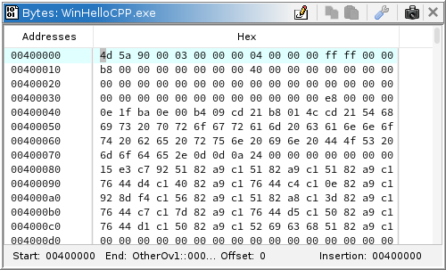
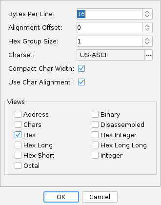
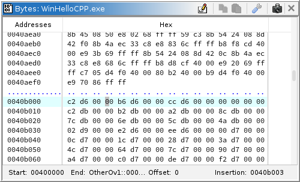
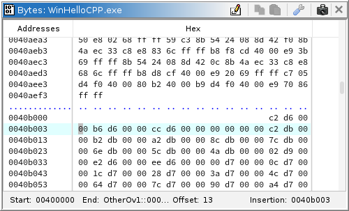

[Home](../index.md) > [ByteViewerPlugin](index.md) > Byte Editing

# The Byte Viewer

The Byte Viewer displays bytes in memory in various formats, e.g.,
Hex, Characters, Octal, etc. The figure below shows the Byte Viewer
plugin in a separate window from the
[default
tool](../Tool/Ghidra_Tool_Administration.md#default-tool), the Code Browser.

To show the Byte Viewer, select the icon, ,
on the Code Browser toolbar, OR, choose the **Window**
→  **Bytes: ...** menu.

The following paragraphs describe the Byte Viewer.

## Boundaries

The Byte Viewer creates boundaries between memory blocks. Whenever a memory block
boundary is encountered, the Byte Viewer will display a line of dots to indicate the
transition to a new memory block. Since the Byte Viewer shows multiple addresses on a line,
the block may start or end at some position other than the start of the line. In this case
any value positions on a line that are not part of the current block are blank.

One special
case is when a multi-byte value spans adjacent memory blocks, the value that spans the
blocks is shown with the block that it starts in. To indicate that the value spans blocks,
it is displayed in a different color, which by default, is gray.

Also, note that when a block starts somewhere other than the beginning of the line, the
address shows the address of the first byte in the block, regardless of what position it
starts at.

## Data Formats

This section describes the formats that Ghidra provides by
default. Each format is an instance of a DataFormatModel interface,
so any [new formats that you provide](#writing-your-own-format-plugin)
will automatically show up in the *Byte Viewer Options* dialog that
lists the data formats that may be added to your view.

To add or remove a data format view from the tool, press the
 icon to bring up the
*Byte Viewer Options* dialog. Select the formats that you want and press the
**OK** button.

### Hex

The **Hex** view shows each byte as a two character hex value. [Change the group size](#hex-group-size) for the Hex format to show
the bytes grouped in that size. When you add the Byte Viewer
plugin to a tool and then open a program, the Hex view is automatically
displayed by default.

This view supports byte [editing](#editing-memory).

### Chars

The **Chars** view shows each byte (or group of bytes) as its equivalent
character, using a JVM installed charset.  Typical examples will be US-ASCII
(1 byte per character), UTF-8 (between 1 and 3 bytes per character), UTF-16
(typically 2 bytes per character, but can also require 4 bytes for some).

For those bytes that do not encode a valid Unicode character, the view shows
it as a tic (".").

Some characters, though valid, will not be able to be displayed if the active
font does not support that character.  Typically these characters are rendered
as a blank square or some other distinctive shape to indicate the issue.

This view supports byte [editing](#editing-memory).

### Address

The **Address** view displays a tic (".") for all bytes whose
formed address does not fall within the range of memory for the
program. For those addresses that can be formed and are in memory, the
view shows the symbol, 
So if you go to that address in the [Code Browser](../CodeBrowserPlugin/CodeBrowser.md), and
[make a
Pointer data type](../DataPlugin/Data.md#pointer), the address pointed to is in memory. Conversely, if
you go to a "tic" address in the Code Browser and make a pointer, the
address pointed to is not in memory (the operand is rendered in red).

This view does not support [editing](#editing-memory).

### Disassembled

The **Disassemble** view shows a "box"
() symbol
for each address that has undefined bytes. For those addresses that are
[instructions](../Glossary/glossary.md#instruction) or
[defined data](../Glossary/glossary.md#data-item), the
view shows a tic ("."). With this view, you can easily see what areas of the
program have been disassembled.

This view does not support [editing](#editing-memory).

### Hex Short

This format shows two-byte numbers represented as an four-digit hex number.

This view supports [editing](#editing-memory). When a byte is changed,
both bytes associated with this address are rendered in
red to denote the change.

### Hex Integer

This format shows four-byte numbers represented as an eight-digit hex number.

This view supports [editing](#editing-memory). When a byte
is changed, all four bytes associated with this address are rendered in
red to denote the change.

### Hex Long

This format shows eight-byte numbers represented as an 16-digit hex number.

This view supports [editing](#editing-memory). When a byte
is changed, all eight bytes associated with this address are rendered in
red to denote the change.

### Hex Long Long

This format shows 16-byte numbers represented as an 32-digit hex number.

This view supports [editing](#editing-memory). When a byte
is changed, all 16 bytes associated with this address are rendered in
red to denote the change.

### Integer

This view shows four-byte numbers represented in decimal format.

This view does not support [editing](#editing-memory).

### Octal

The octal view shows each byte as a three character octal value.

This view supports [editing](The_Byte_Viewer.md#editing-memory).

### Binary

The binary view shows each byte as an eight character binary value.

This view supports [editing](#editing-memory).

## Status Fields

The labels below the scroll pane that contains the views shows the following
information:

| Start | The minimum address of Memory |
| --- | --- |
| End | The maximum address of Memory |
|  Offset | Displayed in decimal, the 					number of bytes added to each block of memory that is being displayed. 					This number is calculated when you set the [alignment 					offset](#alignment-offset) or the number of bytes per line. |
| Insertion | The address of your current cursor location |

## Editing Memory

To enable byte editing,

1. Toggle the Enable/Disable Edit toolbar button
 so that it appears pushed-in.
2. Click in a view that supports editing, e.g., Hex or Chars
3. The cursor changes to red to indicate that this view can be edited.

Changing bytes is allowed only if your cursor is at an address
that does not contain an instruction. If you attempt to change a byte
of an instruction, an "editing not allowed" message is displayed in the
status area of the tool.

Changed bytes are rendered in red.
This color can be changed via the
[Byte Viewer Edit Options](ByteViewerOptions.md#colors-and-font)
by double-clicking on the *[Edit Color](ByteViewerOptions.md#colors-and-font)*
field.

Undo the edit by hitting the Undo button ([Undo]) on
the tool. The byte reverts to its original value. Redo your edit by
hitting the Redo button ([Redo]).

To turn off byte editing, click the Enable/Disable Edit toolbar button
 so that it no longer appears pushed-in.

> **Note:** If you have two Byte Viewers running, you can connect the two tools for the "Byte Block Edit" event so that when you make
changes in one Byte Viewer, the other will reflect those changes in red.

## Cursor Colors

The format view that currently has focus shows its cursor in **black**. (Cursor colors can be changed via the [Options](ByteViewerOptions.md#colors-and-font) dialog) If
the byte editing is enabled and the view that is in focus supports
editing, then the cursor is **red**.

## Byte Viewer Options

The *Byte Viewer Options* dialog can be
used to add and remove views, set the *alignment offset*, set the number
of *bytes per line*, and set the *group size* to be used by the *hex*
view.

To launch the *Byte Viewer Options* dialog,
press the  icon on the Byte Viewer toolbar.

### Bytes Per Line

The bytes per line value indicates how many bytes are displayed in one
line in a view. The default value is 16.

> **Note:** All formats shown must be able to support the new value.
For example, since the HexInteger and Integer formats show
bytes in groups of four, the bytes per line must be a multiple of four.
If a selected format cannot support a value for the bytes per line, an
error message will appear and the OK button will be disabled.

### Alignment Offset

The alignment offset controls which bytes should appear in column 0. This enables
you to view bytes in an offcut manner and to identify patterns in the bytes.
The offset is displayed as a label below the scroll pane containing the views.

> **Tip:** Sometimes
you might see a byte pattern such that you want all the bytes
to line up in the first column of the display. Consider the cursor position in the
image below:

If you want the fourth column of bytes (values of 00) to appear in
the first column, you need to decrease the alignment offset by 3, either by using
the **Shift Bytes Left** popup action (or hitting **Ctrl+Comma**) a few times,
or by changing the alignment offset value in the configuration dialog.

The result of setting the alignment offset is shown below.

### Hex Group Size

The group size is the number of bytes that the Hex view shows as
a "unit." For example, a group size of two means to show two bytes
grouped together with no spaces.

### Charset

This specifies how bytes are converted into characters.  Typically
**US-ASCII** or **UTF-8** are good choices, but other charsets
that are installed in your Java JVM will be available also.

Character encoding schemes that use more than 1 byte to encode a
character are supported, but can produce incorrect values interlaced
with the actual text characters that should be there, as each byte is treated
as the starting position of a character, even if it was already 'used' by
a previous multi-byte character.

For instance, if a sequence of UTF-8 characters are being displayed, and
some characters take 1 byte while some take 2 or 3, the positions in the
**Chars** display grid that are not valid starting locations may display
garbage, or just a "." dot indicating the byte could not be decoded.

Character encoding schemes that rely on escape sequences to shift between
code pages will not produce useful values in the **Chars** display grid as
each byte (and some number of following bytes) are treated as a unique string
to decode and will not include any previous escape sequences that would be needed
to correctly decode the bytes in question.

The available charsets are listed in a dialog that is displayed
when clicking the **"..."** browse button.  You can filter by name, sizes,
supported scripts, etc by using the standard table filter mechanisms.

### Compact Char Width

This option toggles between wide and narrow display of characters.  If
displaying ASCII or other Latin alphabet based text, the narrow option should
be sufficient to be able to see each character.

If displaying data that has non-Latin alphabets (scripts) the wide option
will prevent characters from overwriting their neighbors.

### Use Char Alignment

This option will only display characters for fixed-width multi-byte character
sets (such as UTF-16, UTF-32) starting at aligned offsets, avoiding converting
bytes sequences that are not aligned with the charset alignment size.

Use the [alignment offset](#alignment-offset) option to control
where the starting offset for aligned characters is located.

**NOTE**: UTF-16 is not technically a fixed-width character encoding, as a
single character may need 2 or 4 bytes to be encoded.  However, it is
self-synchronizing and the 2nd half of a 4 byte sequence should be ignored and
rendered as a "." dot.

**NOTE**: An align-able charset needs to be marked with its alignment size in
the **charset_info.json** configuration file, and by default only UTF-16 and
UTF-32 have these values.

### View Selection

Each potential view is listed as a checkbox. Select the
checkboxes corresponding to the views to be shown. Red text
indicates a view cannot be displayed since it doesn't support the
specified number of bytes per line.

## Reorder / Resize Views

The various views in the ByteViewer can be reordered by dragging
the view header to the left or right of its current position. The view
positions are swapped.

The width of each view can also be changed by dragging the separator
bars in the view header to the left or right. This will resize the view that is to
the left of the separator bar.

## Writing Your Own Format Plugin

To supply your own format to be added to the list of views
displayed in the Byte Viewer,

1. Write an implementation of the ghidra.app.plugin.core.format.DataFormatModel interface,
which determines the format of how the bytes should be represented.
2. Edit your [Plugin
path](../FrontEndPlugin/Edit_Plugin_Path.md) to include your class files if you are running Ghidra in production
mode versus development mode; in development mode, you will have
to add your class files to your classpath in your development environment.
3. Restart Ghidra.

Provided by: *Byte Viewer Plugin*

**Related Topics:**

- [Byte Viewer Options](ByteViewerOptions.md)
- [Pointer data types](../DataPlugin/Data.md#pointer)
- [Charsets](../Charsets/Charsets.md)
- [Code Browser](../CodeBrowserPlugin/CodeBrowser.md)
- [Configure Tool](../Tool/Configure_Tool.md)
- [Select Bytes](../SelectBlockPlugin/Select_Block_Help.md)

---

[← Previous: Formats](The_Byte_Viewer.md) | [Next: Configuration Options →](ByteViewerOptions.md)
