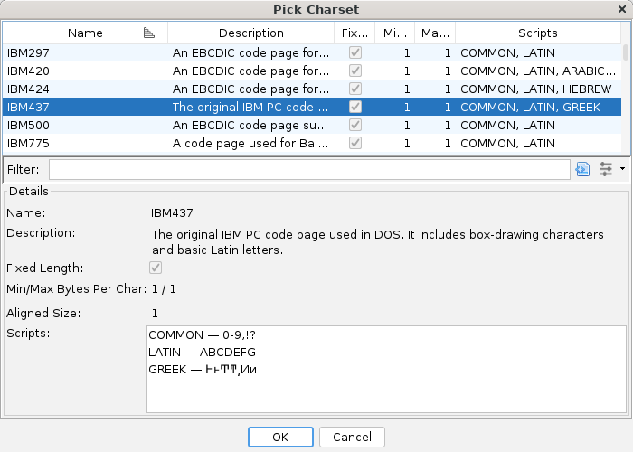

[Home](../index.md) > [Charsets](index.md) > Charsets

# Charsets

Charsets are named mappings between byte sequences and Unicode code points.

Common examples:

- US-ASCII
- UTF-8
- UTF-16

## Unicode Code Point

The term "code point" denotes an integer that represents a character in the Unicode standard.
The first 127 code points map directly to the well-known ASCII characters.

There are approximately 1.1 million defined code points in the Unicode standard.

## Unicode Scripts

Unicode code points are grouped into categories called 'scripts'.  For example, the Latin
script contains the well-known ABC..XYZ characters, the Common script contains numbers (0-9) and
punctuation, and the Greek script contains characters such as the delta 'Δ' symbol.

Do not conflate a script (alphabet) with a human language, even though there can be some
correlation.

The Unicode standard that Java implements has about 160 different scripts.

## Charset Picker

The charset picker dialog allows the user to browse the available installed charsets
and select one to be used when decoding strings / character data.

The dialog has a table with the following columns:

### Name

Name of the charset.  Charsets not in the IANA Charset Registry will have a "x-" prefix

### Description

A short description of the charset.

### Fixed Length

Flag to indicate that the charset always uses a fixed number of bytes to encode a character.

### Min BPC / Max BPC (Bytes Per Character)

The minimum and maximum number of bytes that the charset uses to encoded a single character.
This value may include the length of escape sequences that typically only appear once in a
string.

### Scripts

A list of the scripts (alphabets) that the charset can encode/decode characters for.  For
example, US-ASCII can only produce Latin characters (along with ubiquitous Common characters),
whereas the UTF-8 charset can encoded characters for every script that the Unicode standard
supports.

In the Details panel, the **Scripts** list also can contain a short snippet of example
characters from that script (if your font supports the script in question).

### Charset **Details**

Below the dialog's table is an area that displays the details of the charset, which
in addition to the information displayed in the table contains:

### Aligned Size

For charsets where the bytes of encoded characters should be treated as a larger-than-byte
integer type (because they would have been specified as arrays of those integer types), this
field will specify the size of that integer.  Currently, only UTF-16 and UTF-32 specify a
value for this setting.

**Related Topics:**

- [Search .. for Strings](../Search/Search_for_Strings.md)
- [Search for Encoded Strings](../Search/Search_for_Strings.md#search-for-encoded-strings)
- [Translate Strings Plugin](../TranslateStringsPlugin/TranslateStringsPlugin.md)
- [String data types](../DataPlugin/Data.md#string-data-types)

---

[← Previous: LibreTranslate](../LibreTranslatePlugin/LibreTranslatePlugin.md) | [Next: Save Image →](../ResourceActionsPlugin/ResourceActions.md)
