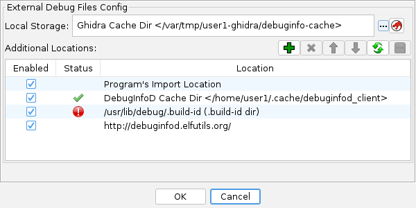

[Home](../index.md) > [DWARFExternalDebugFilesPlugin](index.md) > DWARF External Debug Files

# DWARF External Debug Files

These files contain DWARF debug information that has been stripped from the original binary and
placed into a separate file (typically to save space).  These external files can be found using
information embedded in the original binary's **".gnu_debuglink"** section (a filename and
crc32) and/or **".note.gnu.build-id"** section (a hash value).

Use the `ExtractELFDebugFilesScript` to pull external debug files from
pre-packaged install files, typically provided by Linux / BSD distributions, for later
consumption by Ghidra.

The DWARF analyzer will use the configured external debug file locations to search for
debug files when it encounters a binary that has external debug information and is missing its
**.debug_info** sections.

## Configuration

See **Edit → DWARF External Debug Config**

- **Local Storage** - the location where files downloaded
from remote debuginfod servers will be stored.  This defaults to a Ghidra specific cache
directory, but can be changed to debuginfod's cache directory, or any other location.
- **Additional Locations** - a list of locations to search when trying to find
a debug file.

### Button actions:
  -  (Add) Adds a location.  See [Debug location types](#debug-location-types)
  -  (Delete) Deletes the highlighted row
  -  (Up/Down) Moves the highlighted row up or down
  -  (Refresh) Updates the status of all rows
  -  (Save) Saves the current information

### Debug location types:

- **Program's Import Location** - searchs the directory from which the program was
imported for any debug-link specified files, and for build-id specified files named
`aabbcc...zz.debug`, where `aa..zz` is the build-id hash in hex.
- **Build-id Directory** - directory where debug files that are identified by a
build-id hash are stored.
Debug files are named `aa/bbccdd...zz.debug` under the base directory
This storage scheme for build-id debug files is distinct from debuginfod's scheme.
Example: `/usr/lib/debug/.build-id`
- **Debug Link Directory** - directory where debug files that are identified by a
debug filename and crc hash (found in the binary's .gnu_debuglink section).
**NOTE**: This directory is searched recursively for a matching file.
- **Debuginfod Directory** - directory where debuginfod has stored files.  This
typically will be something like `/home/user/.cache/debuginfod_client`.
- **Debuginfod URL** - HTTP(s) URL that points to a debuginfod server.
- **Import DEBUGINFOD_URLS Env Var** - Helper action that adds any HTTP(s) URLs found
in debuginfod's environment variable.

Provided by: *DWARF External Debug Files Plugin*

---

[← Previous: Query Results Window](../Search/Query_Results_Dialog.md) | [Next: PDB →](../Pdb/PDB.md)
